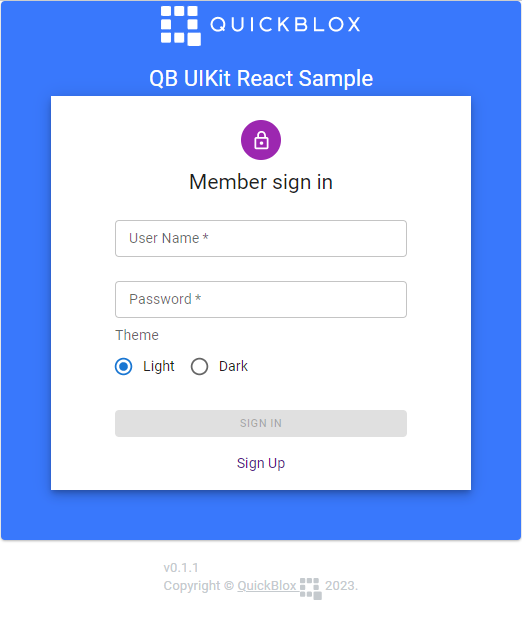
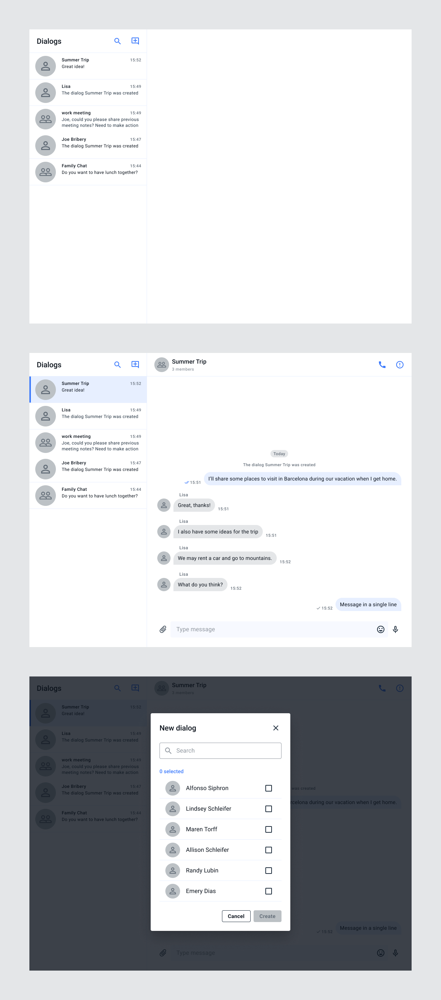

# Table of Content

- [About](#about)
- [Requirements](#requirements)
- [Screenshots](#screenshots)
- [Features](#features)
- [How to launch](#how-to-launch)
    * [1. Install Node.js and NPM integration](#1-install-nodejs-and-npm-integration)
    * [2. Run on development server](#4-run-on-development-server)
      + [2.1 Get application credentials](#21-get-application-credentials)
      + [2.2 Set application credentials](#22-set-application-credentials)
      + [2.3 Run the application](#23-run-the-application)
- [Documentation](#documentation)
- [License](#license)

# About
[](#about)
QuickBlox UIKit React Sample

This is a code sample for [QuickBlox](http://quickblox.com/) platform. It is a great way for developers using QuickBlox platform to learn how to integrate private and group chat, add text and image attachments sending into your application.

# Requirements
[](#requirements)

The minimum requirements for QuickBlox UIKit for React sample are:

- JS QuickBlox SDK v2.15.5
- QuickBlox React UIKit library v0.2.3
- React JS v.18.0
- TypeScript v.4.9.3

# Screenshots
1. Sign In page;

    

2. Sign Up page;

   

3. UIKit;

    

# Features

* Sign in/Sign up and Log out
* Set up custom theme
* Send and receive message/attachment
* Create and leave a 1-to-1 and group chat
* Create a public chat
* Display users who have received/read the message
* Mark messages as read/delivered
* Send typing indicators
* List and delete chats
* Display chat history
* Display a list with chat participants

# How to launch
## 1. Install Node.js and NPM integration

You should use QuickBlox JavaScript SDK and QuickBlox UIKit with server-side applications on NodeJS through the native node package.
Just install the package in your application project:

Navigate the current project folder ***\samples\react-chat*** and type

```bash
npm install
```

## 2. Run on development server

### 2.1 Get application credentials

QuickBlox application includes everything that brings messaging right
into your application - chat, video calling, users, push notifications,
etc. To create a QuickBlox application, follow the steps below:

1.  Register a new account following [this
    link](https://admin.quickblox.com/signup). Type in your email and
    password to sign in. You can also sign in with your Google or Github
    accounts.
2.  Create the app clicking **New app** button.
3.  Configure the app. Type in the information about your organization
    into corresponding fields and click **Add** button.
4.  Go to **Dashboard =\> *YOUR\_APP* =\> Overview** section and copy
    your **Application ID**, **Authorization Key**, **Authorization
    Secret**, and **Account Key**.

### 2.2 Set application credentials

Before run a code sample:
1. get appId, authKey, authSecret, and accountKey
2. put these values in file **QBconfig.ts** following **samples =\>
   react-chat =\> src\** directory.

   TypeScript
```ts
        export const QBconfig  = {
          credentials: {
            appId: '',
            authKey: '',
            authSecret: '',
            accountKey: ''
          }
        }
```

### 2.3 Run the application

Run `npm start` for a dev server. Navigate to `http://localhost:3000/`. The app will automatically reload if you change any of the source files.

# Documentation
[](#documentation)
Sample documentation is available [here](https://docs.quickblox.com/docs/react-uikit).

# License
[](#license)
MIT License [here](https://github.com/QuickBlox/react-ui-kit/blob/main/LICENSE.md).

Copyright © 2023 QuickBlox
